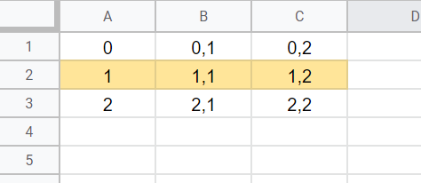

This is a simple app to use to generate content on a webpage using Thymeleaf and Google Sheets API.

To generate your JSON key, go to:
[https://console.cloud.google.com](https://console.cloud.google.com/)
Create a developer account and follow the instructions on how to obtain OAuth credentials.

Save your key as "**credentials.json**" inside resources.

```java
private static String APP_NAME = " YOUR APP NAME";
private static String SHEET_ID = " REPLACE WITH YOUR OWN SHEET ID ";
```

**Sheet ID**: https://docs.google.com/spreadsheets/d/**IDHERE**/edit#gid=0

Make sure you share your sheet as **READ** only.

You can modify the range as needed. The idea is to have the content per field, so no need to be too organized unless you want to.

**greet!A1:G20** = **SHEETNAME**!A1:ZZ999

```java
private staticList<Object> readRowFromSheet(intn)throwsGeneralSecurityException,IOException{
Stringrange= "greet!A1:G20";
ValueRangeresponse=sheetService.spreadsheets().values().get(SHEET_ID,range).execute();
List<List<Object>>values=response.getValues();
returnvalues.get(n);
}
```

The Model can be modified with the text you might need.

The Controller  need to be adjusted per field you wish to read.

Rows start at 0, which is usually title of column. Or not, as you wish.

$$
readColumnFromRow(ROW,COLUMN)
$$

```
sheetModel.setGreeting(String.valueOf(sheets.readColumnFromRow(1,0)));
sheetModel.setName(String.valueOf(sheets.readColumnFromRow(1,1)));
sheetModel.setQuote(String.valueOf(sheets.readColumnFromRow(1,2)));
```



You can also use HTML tags in the fields inside sheets and parse them with thymeleaf using <p th:utext=""></p>
